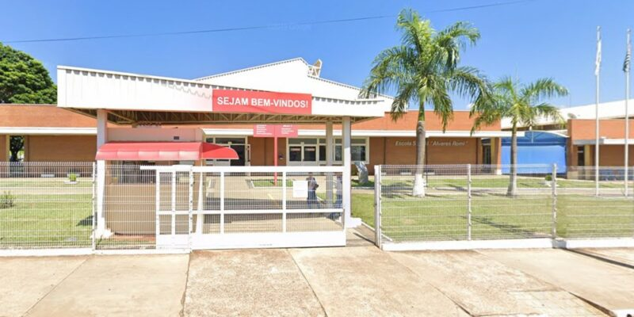

# Manual do Aluno

Com quase 70 anos de história, a escola SENAI “Alvares Romi” começou sua jornada em 1958, funcionando dentro das Indústrias Romi, em Santa Bárbara d’Oeste. Depois de passar um tempo na Fundação Romi, a escola finalmente ganhou uma sede própria e moderna no Distrito Industrial I, em 2008. De lá para cá, o SENAI se tornou uma verdadeira referência, somando mais de 100 mil formações entre cursos próprios e treinamentos feitos em parceria com empresas. É muita gente preparada para o mercado de trabalho em todos esses anos de estrada.
